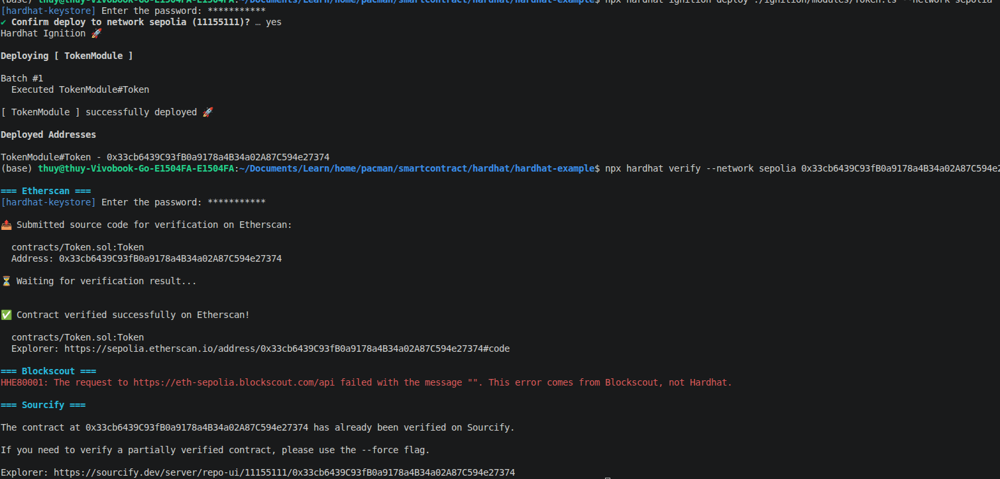

https://github.com/zeeshanhanif/defi-projects/tree/main/02_ERC721_Token_Hardhat
https://hardhat.org/docs/getting-started
https://v2.hardhat.org/tutorial/testing-contracts
https://www.quicknode.com/guides/ethereum-development/dapps/how-to-build-your-dapp-using-the-modern-ethereum-tech-stack-hardhat-and-ethersjs

### What is hardhat?
Hardhat is a flexible and extensible development environment for Ethereum software. It enable you to **write, test, debug and deploy your smart contracts** with ease

Hardhat comes built-in with Hardhat Network, a local Ethereum network designed for development. It allows you to deploy your contracts, run your tests and debug your code, all within the confines of your local machine. It's the default network that Hardhat connects to, so you don't need to set up anything for it work. Just run your tests.
```sh
npx hardhat test test/Token.ts
```

### What is hardhat-view plugin?
The hardhat-view plugin integrates **Viem, a lightweight, type-safe TypeScript library**, into the Hardhat development environment. It provides efficient, low-level tools to interact with Ethereum-compatible blockchains, serving for **testing, deploying, and managing smart contracts**.

### What is Hardhat Ignition?
Deployments are defined through Ignition Modules. These modules are abstractions to describe a deployment

### Hardhat vs Ganache
- Ganache is a personal blockchain preferred by beginers for visualizing transactions. It is no lonfer mataintained
- Harhat is the industry-standard development framework for Ethereum, offering debuging, testing and built-in network node functionality

### What is Etherscan?
- Etherscan (https://etherscan.io/): The primary tool for navigating the Ethereum Mainnet used to check transactions, token balances, and gas prices in real-time
- Sepolia Etherscan (https://sepolia.etherscan.io): This is the specific version of the Etherscan interface tailored to the Sepolia testnet

### What is Sepolia? What is Alchemy?
To test a decentralized application before deploying it to the Ethereum mainnet, web3 developers will deploy their smart contracts on a public testnet. **Sepolia is a Proof-of-Stake testnet used to validate** the functionality of their dapps before migrating them to Ethereum's layer one blockchain.

**Create a free Sepolia RPC endpoint on Alchemy for deploying your smart contracts on the Sepolia testnet.**

Alchemy is **an RPC node provider that connects your wallet (like MetaMask) to the blockchain**. To get the private key for a Sepolia dapp, you must export it from the wallet used to interact with the dapp


### How to deploy and test a smart contract
The smart contract was deployed on 1 of 2 networks
- **Local** network (Hardhat, Anvil): Use __npx hardhat node__ to create a temporary, personal blockchain to test deployments, transaction logic, and contract interactions locally
- **Testnet** (Sepolia/Goerli): Public testnets simulate mainnet conditions (gas fees, latency) using test tokens, providing a more realistic testing environment
Tools like Hardhat, Foundry, or Remix to deploy and verify functionality 

For example:
1. Deploy smart contract to Sepolia testnet using Hardhat
```sh
npx hardhat keystore set SEPOLIA_RPC_URL
#[Link My Alchemy project dashboard](https://dashboard.alchemy.com/apps/tkkca2hqcheip744/setup)

#Endpoint URL: https://eth-sepolia.g.alchemy.com/v2/nf7ccD252FXE8pH42znQE

#[Link My Infura project dashboard](https://developer.metamask.io/key/active-endpoints)
#Endpoint URL: https://sepolia.infura.io/v3/55f29f249dc1464298d87c9a16475c5a

npx hardhat keystore set SEPOLIA_PRIVATE_KEY
# How to get your private key of Account
# 1. Select Account Details in MetaMask wallet
# 2. Click Export Private Key

npx hardhat ignition deploy --network sepolia ignition/modules/Counter.ts
```

2. Go to the [Sepolia etherscan](https://sepolia.etherscan.io/address/0x3926371d5800b5B7e4bf3e604BDb2b38160d8347) and search for the recently deployed contract address

3. Verify and Publish Smart Contract Code to Etherscan


