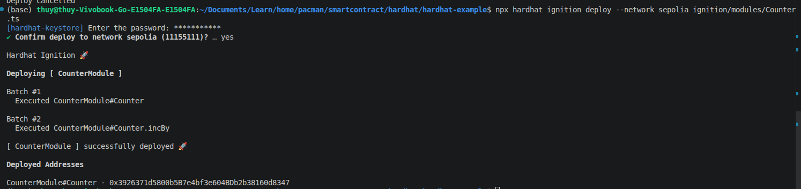
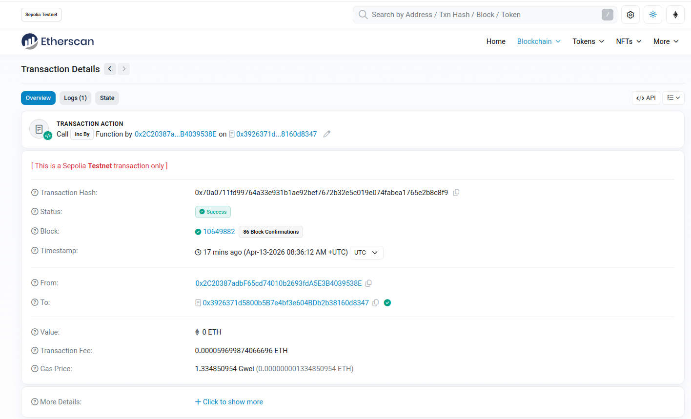

https://github.com/zeeshanhanif/defi-projects/tree/main/02_ERC721_Token_Hardhat
https://hardhat.org/docs/getting-started
https://v2.hardhat.org/tutorial/testing-contracts

### What is hardhat?
Hardhat is a flexible and extensible development environment for Ethereum software. It enable you to **write, test, debug and deploy your smart contracts** with ease

### What is hardhat-view plugin?
The hardhat-view plugin integrates **Viem, a lightweight, type-safe TypeScript library**, into the Hardhat development environment. It provides efficient, low-level tools to interact with Ethereum-compatible blockchains, serving for **testing, deploying, and managing smart contracts**.

### What is Sepolia? What is Alchemy?
To test a decentralized application before deploying it to the Ethereum mainnet, web3 developers will deploy their smart contracts on a public testnet. **Sepolia is a Proof-of-Stake testnet used to validate** the functionality of their dapps before migrating them to Ethereum's layer one blockchain.

**Create a free Sepolia RPC endpoint on Alchemy for deploying your smart contracts on the Sepolia testnet.**

[Link My Alchemy project dashboard](https://dashboard.alchemy.com/apps/tkkca2hqcheip744/setup)

Endpoint URL: https://eth-sepolia.g.alchemy.com/v2/nf7ccD252FXE8pH42znQE

Alchemy is **an RPC node provider that connects your wallet (like MetaMask) to the blockchain**. To get the private key for a Sepolia dapp, you must export it from the wallet used to interact with the dapp

### How to get your sepolia private key
1. Open your MetaMask extension
2. Ensure you are connected to the Sepolia Test Network
3. Select Account Details
4. Click Export Private Key
Private Key: ac7aef3f0e3b34d0051fd9f3d71d5a02434d3d6c1ac4d3ae931cdc5984df41a1

Etherscan.io using with username thuyltm2201 and password Etherscan@123


https://v2.hardhat.org/tutorial/testing-contracts

### How to deploy and test a smart contract
The smart contract was deployed on 1 of 2 networks
- Local network (Hardhat, Anvil): Use __npx hardhat node__ to create a temporary, personal blockchain to test deployments, transaction logic, and contract interactions locally
- Testnet (Sepolia/Goerli): Public testnets simulate mainnet conditions (gas fees, latency) using test tokens, providing a more realistic testing environment
Tools like Hardhat, Foundry, or Remix to deploy and verify functionality 

For example:
1. Deploy smart contract to Sepolia testnet using Hardhat
```sh
npx hardhat ignition deploy --network sepolia ignition/modules/Counter.ts
```

2. Go to the [Sepolia etherscan](https://sepolia.etherscan.io/address/0x3926371d5800b5B7e4bf3e604BDb2b38160d8347) and search for the recently deployed contract address


