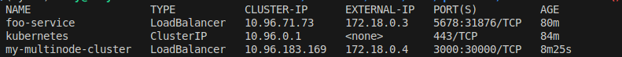
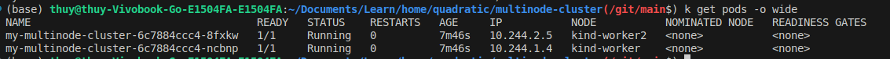

#### Set `imagePullPolicy: Always` in the file deployment.yaml
```sh
docker build -t thuyltm2201/my-multinode-cluster:latest -f ./quadratic/multinode-cluster/Dockerfile .
docker push thuyltm2201/my-multinode-cluster:latest
```
[Bug: Docker push - net/http: TLS handshake timeout](https://stackoverflow.com/questions/41070528/docker-push-net-http-tls-handshake-timeout)
```sh
sudo cat >> /etc/docker/daemon.json << EOF
> {
> "max-concurrent-uploads": 1
> }
> EOF
```
#### Install and Start Cloud Provider KIND (Behinded Envoy Proxy)
```sh
go install sigs.k8s.io/cloud-provider-kind@latest
cloud-provider-kind --gateway-channel standard|experimental|disabled
```
Current usage of Cloud Provider KIND is to provide External IP for services in the kind cluster


### Use Kind to create cluster and skaffold can be used to deploy directly
```sh
kind create cluster --config kind-config.yaml 
skaffold dev
```


### Testing
```sh
export LB_IP=$(kubectl get svc/my-multinode-cluster -o=jsonpath='{.status.loadBalancer.ingress[0].ip}')
for _ in {1..10}; do
  curl ${LB_IP}:3000
done
```