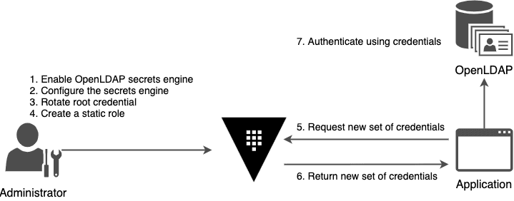

[Guide](https://developer.hashicorp.com/vault/tutorials/secrets-management/openldap)

### What is LDAP
LDAP stands for __Lightweight Directory Access Protocol__. When a user attempts to log in to an application, the application sends a search request using the LDAP protocol __to the directory server__. The directory server checks the provided credentials against its stored database

Key Concepts
1. Directory Service: LDAP stores information as objects and attributes (e.g., users, groups, devices, and permissions) in a tree-like structure.
2. Centralized Authentication: With LDAP, all usernames, passwords, and access rights are stored in one central server. Applications query this server to verify if a user has a permission to log in

### Use the LDAP with Vault
Use the LDAP with Vault, you can configure their passwords to be automatically rotated based on an administrator-specified time to live value

By making passwords short-lived as possible, you reduce the chance thaty they become breached.